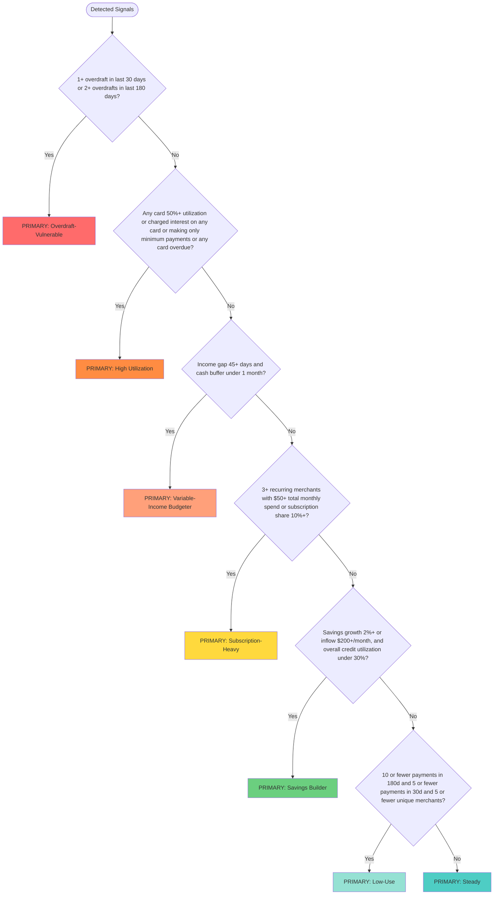

# Persona Assignment Specification

**Version:** 1.0
**Date:** November 4, 2025
**Status:** Draft

## Overview

This document defines the logic for assigning financial personas based on detected signals. Each persona maps to specific behavioral patterns and triggers tailored recommendations.

## Personas

We support 7 personas, evaluated in strict priority order (top to bottom):

1. **Overdraft-Vulnerable**
2. **High Utilization**
3. **Variable-Income Budgeter**
4. **Subscription-Heavy**
5. **Savings Builder**
6. **Low-Use**
7. **Steady** (default)

## Prioritization Logic

When multiple personas match, we assign the **first matching persona** in the list above. The order is intentionally designed so that:

- **Financial risks** (Overdraft-Vulnerable, High Utilization, Variable Income) are addressed first
- **Spending optimization** (Subscription-Heavy) comes next
- **Positive behaviors** (Savings Builder) are celebrated before engagement issues
- **Engagement opportunities** (Low-Use) follow
- **Default state** (Steady) when nothing else matches

### Why This Order?

1. Users in financial distress need immediate help with risk management
2. Spending optimization helps prevent future problems
3. Celebrating savings encourages continued positive behavior
4. Low-use detection helps engagement but isn't urgent
5. Steady users get baseline affirming messaging

## Decision Tree (Primary Insight Assignment)

**Note:** This determines your primary insight. Additional insights may be noted, but the user will be guided to the most important information.



## Persona Formulas

### 1. Overdraft-Vulnerable

**Signal:** `overdrafts.detected === true`

**Formula:**
```typescript
count30d >= 1 OR count180d >= 2
```

**Evidence Required:**
- `overdrafts['30d'].evidence.count30d` OR
- `overdrafts['180d'].evidence.count180d`

**Priority:** Highest (immediate financial risk)

---

### 2. High Utilization

**Signal:** `credit.detected === true`

**Formula:**
```typescript
ANY account with:
  utilizationBucket === '50_to_80' OR
  utilizationBucket === 'over_80' OR
  hasInterestCharges === true OR
  minimumPaymentOnly === true OR
  isOverdue === true
```

**Evidence Required:**
- `credit['30d'].evidence.accounts[]` - check each account's utilizationBucket

**Note:** Utilization buckets are:
- `under_30`: < 30%
- `30_to_50`: 30-50%
- `50_to_80`: 50-80%
- `over_80`: ≥ 80%

---

### 3. Variable-Income Budgeter

**Signal:** `income.detected === true`

**Formula:**
```typescript
medianPayGap > 45 AND cashFlowBuffer < 1
```

**Evidence Required:**
- `income['180d'].evidence.medianPayGap`
- `income['180d'].evidence.cashFlowBuffer`

**Priority:** High (cash flow vulnerability)

---

### 4. Subscription-Heavy

**Signal:** `subscriptions.detected === true`

**Formula:**
```typescript
subscriptions.length >= 3 AND (
  totalMonthlySpend >= 50 (in 30d window) OR
  subscriptionShareOfSpend >= 10 (percentage)
)
```

**Evidence Required:**
- `subscriptions['30d'].evidence.subscriptions.length`
- `subscriptions['30d'].evidence.totalMonthlySpend`
- `subscriptions['30d'].evidence.subscriptionShareOfSpend`

**Priority:** Medium (spending optimization)

---

### 5. Low-Use

**Signal:** `bankingActivity.detected === true`

**Formula:**
```typescript
outboundPaymentCount180d < 10 AND
outboundPaymentCount30d < 5 AND
uniquePaymentMerchants < 5
```

**Evidence Required:**
- `bankingActivity['180d'].evidence.outboundPaymentCount180d`
- `bankingActivity['180d'].evidence.outboundPaymentCount30d`
- `bankingActivity['180d'].evidence.uniquePaymentMerchants`

**Priority:** Medium (engagement opportunity)

---

### 5. Savings Builder

**Signal:** `savings.detected === true`

**Formula:**
```typescript
(growthRate >= 2 OR netInflow >= 200/month) AND
overallUtilization.bucket === 'under_30'
```

**Evidence Required:**
- `savings['180d'].evidence.accounts[]` - check growth or inflow
- `credit['30d'].evidence.overallUtilization.bucket` - verify overall utilization < 30%

**Note:** Overall utilization calculated as: `(total balance across all cards) / (total limit across all cards)`

---

### 6. Low-Use

**Signal:** `bankingActivity.detected === true`

**Formula:**
```typescript
outboundPaymentCount180d < 10 AND
outboundPaymentCount30d < 5 AND
uniquePaymentMerchants < 5
```

**Evidence Required:**
- `bankingActivity['180d'].evidence.outboundPaymentCount180d`
- `bankingActivity['180d'].evidence.outboundPaymentCount30d`
- `bankingActivity['180d'].evidence.uniquePaymentMerchants`

---

### 7. Steady

**Default persona when no other conditions match.**

**Formula:**
```typescript
No other persona detected
```

---

## Implementation Notes

### Window Selection

- **Overdrafts:** Use both 30d and 180d (check either)
- **Credit:** Use 30d (most recent snapshot)
- **Income:** Use 180d (longer trend for stability)
- **Subscriptions:** Use 30d (current spending)
- **Banking Activity:** Use 180d (overall pattern)
- **Savings:** Use 180d (growth trend)

### Edge Cases

1. **Multiple signals detected:** Follow priority order
2. **Borderline cases:** Round up (e.g., 49.9% utilization → not stressed)
3. **Missing data:** If signal data unavailable, skip that persona check
4. **Empty arrays:** `subscriptions.length === 0` → not subscription burdened

### Output Format

```typescript
interface PersonaAssignment {
  persona: PersonaType;
  priority: 'highest' | 'high' | 'medium' | 'low' | 'default';
  confidence: number;  // 0-100
  reasoning: string[]; // Why this persona was assigned
  evidence: {
    // Key metrics that led to this assignment
    [key: string]: any;
  };
}
```

### Confidence Scoring

Confidence indicates how strongly the signals match the persona:

- **90-100%:** Multiple strong signals clearly match
- **70-89%:** Strong signal present, some supporting evidence
- **50-69%:** Threshold barely met, weak supporting evidence
- **< 50%:** Default persona (no strong signals)

Example:
- Overdraft Prone with 5 incidents in 30d → 100% confidence
- Credit Stressed with 51% utilization only → 65% confidence

## Testing Strategy

Each persona should have test cases for:

1. **Clear match:** Strong signals that clearly indicate persona
2. **Borderline:** Just barely meeting threshold
3. **Near miss:** Just below threshold (should not match)
4. **Priority override:** Lower priority persona present but higher priority wins
5. **Edge cases:** Missing data, empty arrays, null values

## Next Steps

1. [ ] Review and approve prioritization order
2. [ ] Implement persona assignment algorithm
3. [ ] Create comprehensive test suite
4. [ ] Define recommendation templates per persona
5. [ ] Build assessment generation pipeline
